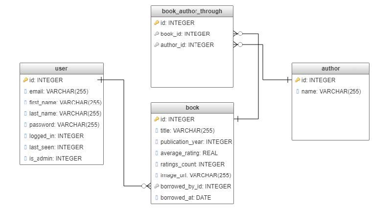

# Python_Library_Project

## Prepared by:
Mustafa SANLI – (Student Nr: 436656)

Ayax Díaz - (Student Nr: 435047)

## Project Description

We implemented a website which can be used by a library, that allows a user to borrow and return books.
In real life, this system could be used in a library in electronic devices (like an ipad) on a local server to allow users to borrow and return books by themselves without the need of a clerk.

## Scope

A full project would require a lot of features:
* Allow a user to scan a barcode of a book to borrow it / return it
* Allow an administrator to create/edit/delete books
* Allow an administrator to create/edit/delete Users
* Allow a User to edit his own profile
* Etc

Since the scope is way too extended for a project like this, we implemented only a few operations:

* The database is prefilled with 100 books
* A user can register and login to the site
* A registered user can borrow books and return books. He is warned that he has 30 days to return it. The operations to borrow and return are just clicks on a webpage, they are not real borrows/returns.

## Data Requirement Analysis

We added a few books from an online sample CSV found on Github (https://github.com/zygmuntz/goodbooks-10k/blob/master/samples/books.csv).
Again, the goal would be for an administrator to be able to add/remove/edit books, but we didn’t have the time to implement all the features we wanted. So, for now, the number of books is fixed, and the database is filled with these books when it is created.

## SQL Tables and Their Definitions

``Author`` table: Stores information about the author's name of a specific set of books or book (many to many) in the online library database.

``Book`` table: Keeps information about all the books in the online library. The books include ``title``, ``publication_year``, ``average_rating``, ``ratings_count``, ``image_url``, ``borrowed_by`` and ``borrowed_at`` as columns.

The ``Borrowed_by`` column is a foreign key that acts as a constraint. It recognizes the ``id`` from the user table.

The ``Borrowed_at`` column shows the date from when the book was chosen.

``Book_author_through`` table: It’s the in between table that allows to link Books and Authors together. It just contains two columns, book_id and author_id. This allows to have a many to many relationship between Books and Authors.

``User`` Table: Stores information about users, it includes ``email``, ``first_name``, ``last_name``, ``password``, ``logged_in``, ``last_seen`` and ``is_admin`` as a columns.

